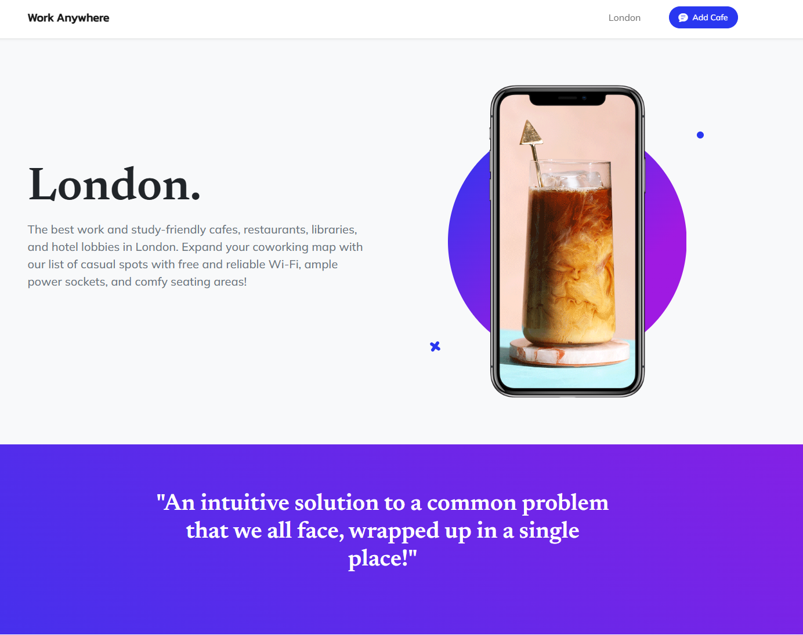
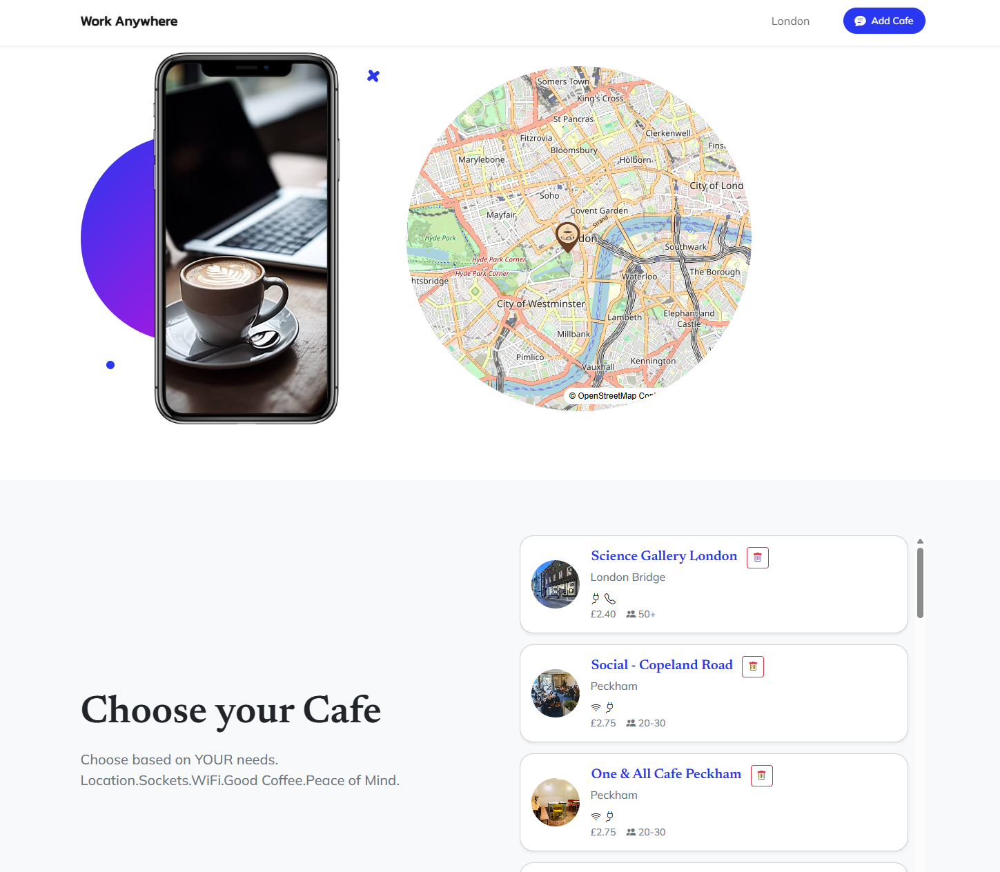

# Work Anywhere

Work Anywhere is a Flask web application that helps users find work- and study-friendly cafés in London.

The website displays cafés on an interactive map and provides useful information such as Wi-Fi availability, power sockets, toilets, phone-call friendliness, seating, and coffee prices.

## Features

- Interactive London map powered by MapLibre and OpenStreetMap
- Café cards with images and useful amenities
- Click a café name to focus the map on its location
- Add new cafés through the website form
- Delete cafés from the list
- Café data stored in a CSV file

## Technologies Used

- Python
- Flask
- HTML and CSS
- Bootstrap
- Jinja templates
- MapLibre GL JS
- OpenStreetMap
- CSV for data storage

## Screenshots

